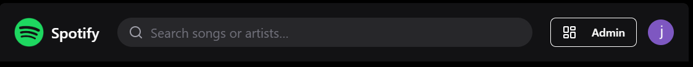
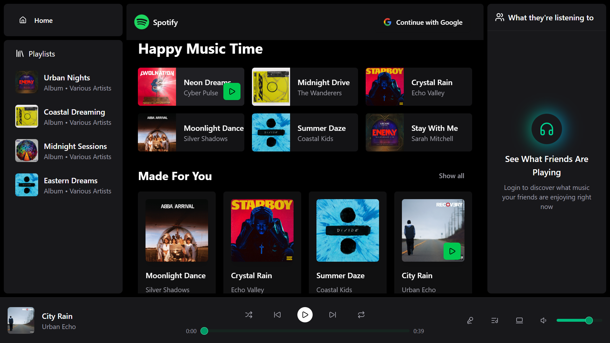
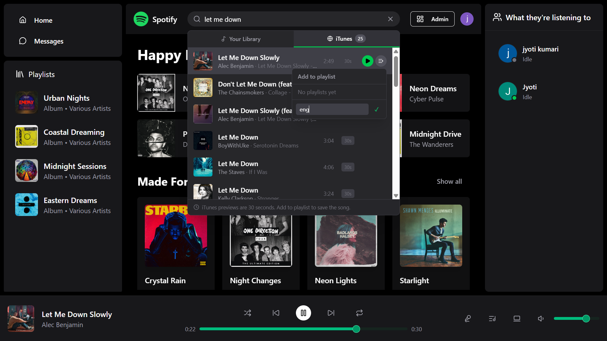
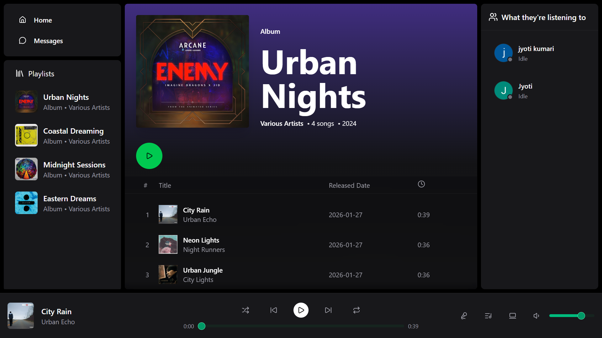
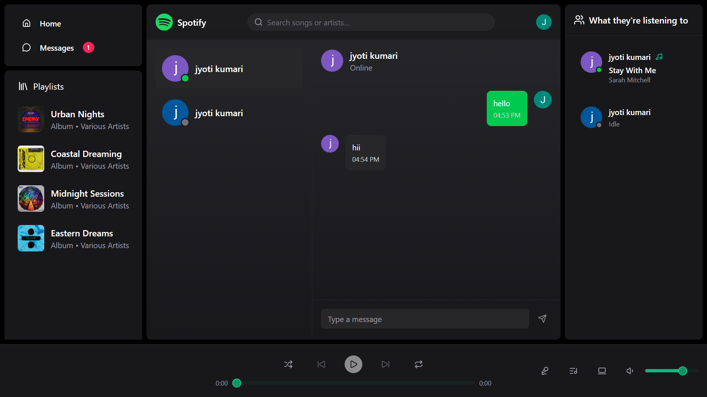
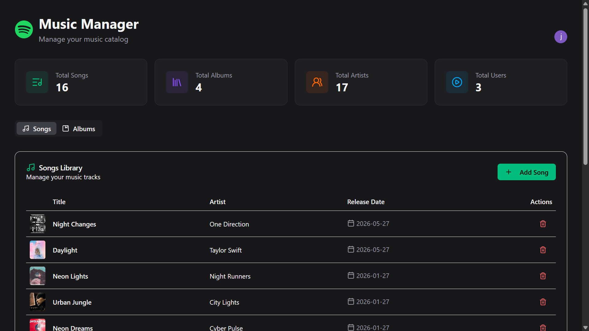

<div align="center">



# Spotify 2.0

**A full-stack Spotify-inspired music streaming app** — with real-time chat, iTunes-powered search, personal playlists, and a live admin dashboard.

🌐 **Live Site → [musix-7xhg.onrender.com](https://musix-7xhg.onrender.com)**

</div>
n
---

## Screenshots

<div align="center">

### Home Page


### Search — Library & iTunes Tabs


### Playlist View


### Real-Time Chat


### Admin Dashboard


</div>

---

<!-- ## Demo

<div align="center">

> Click the thumbnail below to watch the demo video

[](//...demo-video-link-youtube-or-drive)

</div> -->

---

## Features

### Music
- **iTunes-powered search** — search millions of songs via Apple's free iTunes API with instant 30-second previews
- **Library search** — search your own uploaded song library
- **Full audio player** — play, pause, skip, seek, volume control
- **Auto-queue** — featured, trending, and "Made For You" sections feed into the player queue

### Playlists
- Create, rename, and delete personal playlists
- Add any song — local **or** iTunes — to a playlist with one click
- iTunes songs are automatically saved to your library when added to a playlist
- Remove individual songs from playlists

### Real-Time Social
- Live messaging between users via Socket.io
- See what your friends are currently listening to in real time
- Online/offline presence indicators

### Auth & Users
- OAuth sign-in via **Clerk** (Google, GitHub, etc.)
- Protected routes — playlists, chat, and search require sign-in
- Admin role with access to the dashboard

### Admin Dashboard
- Upload songs (audio + cover art) to Cloudinary
- Create and manage albums
- Delete songs and albums
- Live stats: total songs, albums, users, and artists

---

## Tech Stack

### Frontend
| Technology | Purpose |
|---|---|
| React 18 + TypeScript | UI framework |
| Vite | Build tool |
| Tailwind CSS | Styling |
| Zustand | Global state management |
| Socket.io Client | Real-time communication |
| Clerk React | Authentication |
| Radix UI + shadcn/ui | UI components |
| React Router DOM | Client-side routing |
| Axios | HTTP requests |
| Lucide React | Icons |
| React Hot Toast | Notifications |

### Backend
| Technology | Purpose |
|---|---|
| Node.js + Express 5 | REST API server |
| MongoDB + Mongoose | Database |
| Socket.io | Real-time events |
| Clerk Express | Auth middleware |
| Cloudinary | Media storage (songs + images) |
| iTunes Search API | Free external music search |
| node-cron | Scheduled temp file cleanup |
| express-fileupload | Multipart file handling |

---

<!-- ## Getting Started

### Prerequisites
- Node.js v18+
- MongoDB Atlas account (free tier works)
- Clerk account (free)
- Cloudinary account (free)

### 1. Clone the repository

```bash
git clone https://github.com/Jyoti-24-05/spotify2.0.git
cd spotify2.0
```

### 2. Configure environment variables

Create `backend/.env`:

```env
PORT=5000
MONGODB_URI=your_mongodb_atlas_connection_string
ADMIN_EMAIL=your_email@example.com

CLOUDINARY_CLOUD_NAME=your_cloud_name
CLOUDINARY_API_KEY=your_api_key
CLOUDINARY_API_SECRET=your_api_secret

CLERK_PUBLISHABLE_KEY=pk_test_xxxxx
CLERK_SECRET_KEY=sk_test_xxxxx

NODE_ENV=development
```

Create `frontend/.env`:

```env
VITE_CLERK_PUBLISHABLE_KEY=pk_test_xxxxx
```

### 3. Install dependencies & run

```bash
# Install all dependencies (root runs both)
npm install --prefix backend
npm install --prefix frontend

# Start backend (port 5000)
cd backend && npm run dev

# Start frontend (port 3000) — in a new terminal
cd frontend && npm run dev
```

App runs at **http://localhost:3000**

### 4. Seed the database (optional)

```bash
cd backend
npm run seed:songs    # seeds sample songs
npm run seed:albums   # seeds sample albums
```

---

## Project Structure

```
spotify2.0/
├── frontend/
│   ├── src/
│   │   ├── components/       # Topbar, AudioPlayer, UI primitives
│   │   ├── layout/           # Main layout, sidebar, playback controls
│   │   ├── pages/            # Home, Album, Playlist, Chat, Admin, Auth
│   │   ├── stores/           # Zustand stores (music, player, playlist, chat, auth)
│   │   ├── types/            # TypeScript interfaces
│   │   └── lib/              # Axios instance, utilities
│   └── public/
│       └── songs/            # Local audio files
│
├── backend/
│   └── src/
│       ├── controller/       # Route handlers
│       ├── models/           # Mongoose schemas
│       ├── routes/           # Express routers
│       ├── middleware/        # Auth middleware
│       ├── lib/              # DB connection, Socket.io, Cloudinary
│       └── seeds/            # Database seeders
│
└── package.json              # Root build + start scripts
```

---

## Deployment

This app is deployed as a **single service on Render** — the Express backend builds and serves the Vite frontend in production.

| Setting | Value |
|---|---|
| Platform | [Render](https://render.com) |
| Build command | `npm run build` |
| Start command | `npm start` |
| Node version | 18+ |

> Set all backend `.env` variables **plus** `VITE_CLERK_PUBLISHABLE_KEY` in Render's Environment tab (Vite needs it at build time).

---

## 🔌 API Endpoints

### Songs
| Method | Route | Access | Description |
|---|---|---|---|
| GET | `/api/songs/featured` | Public | 6 random featured songs |
| GET | `/api/songs/trending` | Public | 4 random trending songs |
| GET | `/api/songs/made-for-you` | Public | 4 personalised songs |
| GET | `/api/songs/search?q=` | Auth | Search local library |
| GET | `/api/songs/external-search?q=` | Auth | Search iTunes API |
| POST | `/api/songs/save-external` | Auth | Save iTunes song to DB |

### Playlists
| Method | Route | Access | Description |
|---|---|---|---|
| GET | `/api/playlists` | Auth | Get user's playlists |
| POST | `/api/playlists` | Auth | Create playlist |
| POST | `/api/playlists/:id/songs` | Auth | Add song to playlist |
| DELETE | `/api/playlists/:id/songs/:songId` | Auth | Remove song |
| DELETE | `/api/playlists/:id` | Auth | Delete playlist |

### Admin
| Method | Route | Access | Description |
|---|---|---|---|
| POST | `/api/admin/songs` | Admin | Upload song |
| DELETE | `/api/admin/songs/:id` | Admin | Delete song |
| POST | `/api/admin/albums` | Admin | Create album |
| DELETE | `/api/admin/albums/:id` | Admin | Delete album |

---

## Contributing

Pull requests are welcome! For major changes, please open an issue first.

1. Fork the repo
2. Create your branch: `git checkout -b feature/amazing-feature`
3. Commit your changes: `git commit -m 'Add amazing feature'`
4. Push: `git push origin feature/amazing-feature`
5. Open a Pull Request

---

## License

This project is licensed under the **ISC License**. -->

---

<div align="center">

Made by [Jyotika](https://github.com/Jyoti-24-05)

</div>